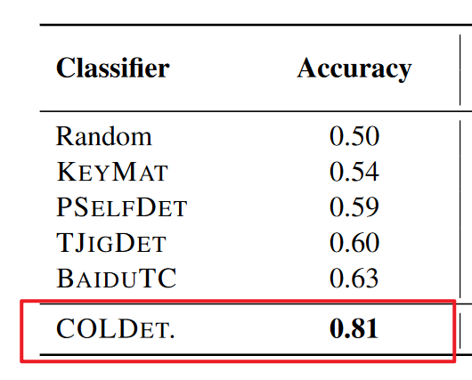
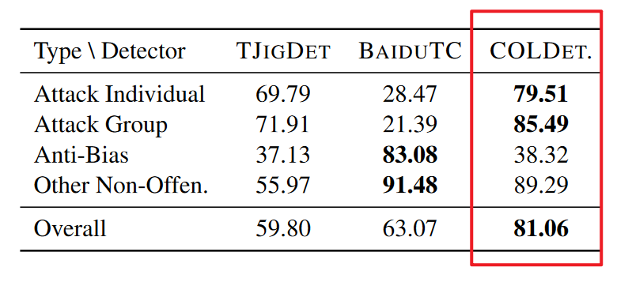

## COLD: A Benchmark for Chinese Offensive Language Detection

[论文原文](http://arxiv.org/abs/2201.06025)

### 选择原因

1. 在其他项目中使用过该模型进行中文恶评的识别（不过当时是直接用别人训练好的参数
2. 作为新手比较容易上手复现其中的训练模型部分
3. 2022年ACL收录论文（近三年

### 主要工作

使用 $COLDataset$ 复现论文中的 $COLDETECTOR$ 并按照其中的评价标准检验模型。

这个 $COLDetector$ 是基于 $Bert$ 的一个预训练模型 $bert$ - $base$ - $chinese$，使用 $COLDataset$ 训练出来的中文文本冒犯性分类模型（分为：$Nonoffensive$ 和 $offensive$）

使用 $Pytorch$ 的 $Bert$ 预训练模型完成此次论文模型复现

文件结构：

1. $COLDataset$ 文件夹：包含训练集、测试集与验证集数据
2. $model$ 文件夹：模型
3. $utils$ 文件夹：实现自定义$DataSet$类型
4. $train.py$ ：训练模型文件
5. $test.py$ ：训练后，测试不同更多操作$fine$ - $grained$ - $label$的句子分类正确率
6. $predict.py$ ：训练后，可以通过修改$text$，判断句子是否带有冒犯性。

### 训练结果

#### 模型对训练集和验证集的效果如下

|         | $Accuracy$ | $Recall$ | $F1$     |
| ------- | ---------- | -------- | -------- |
| $Train$ | $0.9233$   | $0.9458$ | $0.9249$ |
| $Test$  | $0.8172$   | $0.8880$ | $0.7936$ |

#### 模型对具体类别的判别正确率

| $fine$ - $grained$ - $label$ | $Accuracy$ |
| ---------------------------- | ---------- |
| 0: safe (other-Non-offen)    | $0.8713$   |
| 1: attack individual         | $0.8368$   |
| 2: attack group              | $0.8774$   |
| 3: safe (anti-bias)          | $0.3862$   |

可以看出，训练出来的模型还是和论文效果很接近的，除了 $other$ - $Non$ - $offen$ 一类外，其他类别的正确率甚至高于论文训练的结果了。

由于最终模型参数 $offensiveness$_$model.pth$ 达到了 $400MB$，所以在上传附件时就不打包在文件夹中啦。